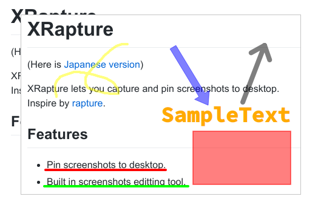

# XRapture
 XRaptureはスクリーンショットをデスクトップにピン止め表示するソフトです。   
 Linuxで動く[rapture](http://www.geocities.jp/knystd/rapture.html)のようなものが欲しかったので作りました。

## Features
 * スクリーンショットをデスクトップにピン止めします。
 * 簡単なペイント機能を内蔵しています。



## Keyboard shortcuts
|Keys|Description|
| ---- | ---- |
|CTRL + O | Open File|
|CTRL + S | Save Image|
|CTRL + C | Copy to clipboard|
|CTRL + V | Paste from clipboard|
|CTRL + Z | Undo|
|1| Zoom 100%|
|2| Zoom 200%|
|5| Zoom 500%|
|Left click + drag| Move window|
|CTRL + Left click + drag| Draw|
|CRTL + Wheel | Change zoom|
|Right click| Open Menu|

## System Requirements
* Linux

## Dependencies
* Qt 5.?
* [SLOP 7.4~](https://github.com/naelstrof/slop)

## Installation
```
$ cmake .
$ make
$ sudo make install
```

## License
* GPLv3
